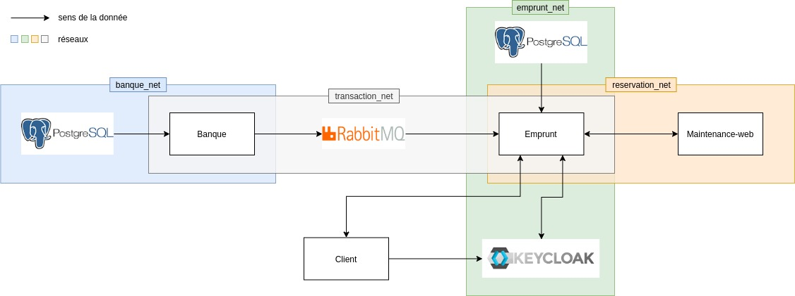
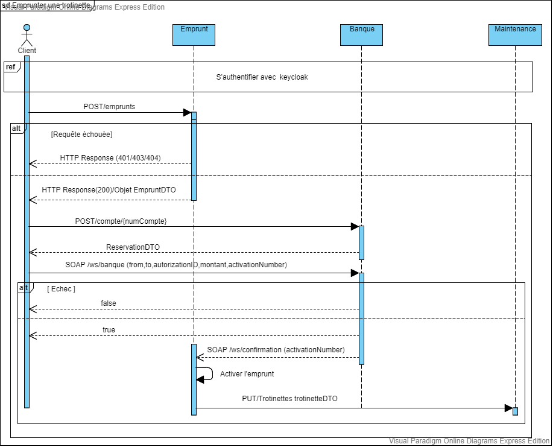

Université Claude Bernard Lyon 1 – M2 TIW – Intergiciels et Services

# TIW1 - Intergiciels et services
## Contexte du TP
L'ensemble des TP de cette UE sera illustré en se plaçant dans le cadre d'une entreprise de location de trottinettes électriques.
Selon le TP, on abordera différentes facettes du système d'information (simplifié) d'une telle entreprise.

## Sommaire
- [Freatures](#Features)
- [Architechture](#Architechture)
- [Usage](#Usage)


## Collaborateurs 
- AISSAOUI Abdelwalid `p1925992`
- BENKARRAD Alaa Eddine `p1925869`

## Features
### Maintenance-web : API de gestion des trottinettes (ajout, suppression...)
Cette api est fournie par l'enseignant. On l'a Dockeriser par la suite

### Banque : APi de gestion des comptes et des transferts banquaires
Cette api est fournie par l'enseignant. On a fait plusieurs modifications telsque:
- Connecter l'api à `Rabbitmq` par l'ajout d'un producteur et sa configuration
- Gerer quelques failles (ex: la vérification de ressemblance entre le montant de transfert et de l'autorisation avant de valider le transfert)
- Faire la configuration nécessaire pour exporter les variables d'environnement et Dockeriser l'application

### Emprunt : API de gestion des abonnées et des emprunts
Cette Api est la base de notre tp, elle comporte les features suivantes :
- Gestion des emprunts de trottinettes 
- Gestion des abonnées 
- Récupération de la liste des trottinettes 
- Sécurisation de l'application par `Keycloak`
	- Création des roles `Admin` et `User`
	- Accès à l'api rest à base de `Access token`
	- Restriction sur l'accès aux ressources (Chaque utilisitaur n'a accès qu'aux ressources qu'il a créée) 
- Gestion d'accès concurrent aux ressources (S'assurer que la réservation d'une trotinnette ne peut être effectué que par un seul utilisateur à la fois)
- Gestion des cas , indisponiblité et inexistance d'une trotinette lors de la création d'un emprunt
- Rendre une trottinette à nouveau disponible si son emprunt n'a été activé (Paiement non effectué) au bout d'une durée limité
- Création d'un service de confirmation d'un emprunt 

## Architechture 
### Schéma globale
Ci dessous l'architecture globale de l'application : 


### Diagramme de séquence


## Usage
### Prérequis
Afin de pouvoir lancer l'application il vous faut :
- docker 
- docker-compose
- jdk11

### Execution
Pour executer l'application localement, suivez les étapes suivantes:
1. clonner le projet
```bash
git clone https://forge.univ-lyon1.fr/tiw-benkarrad---aissoui/tiw1-is-2019.git
```

2. Passez à la branche `tp7`
```bash
git checkout tp7
```

3. générer les artifacts des differents projets `emprunt`, `banque` et `maintenance-web` par la commande maven:
```bash
mvn clean package
```

4. lancez les conteneurs par docker-compose
```bash
docker-compose -f docker-compose.yml up --build -d
```

5. verifier bien que tous les conteneurs sont lancés
```bash
docker ps
```

6. executer le script `root/scripts/keycloak_init_script.sh` sur le conteneur `keycloak_container`
```bash
docker exec -it keycloak_container bash -c "/config/keycloak_init_script.sh"
```

7. done


